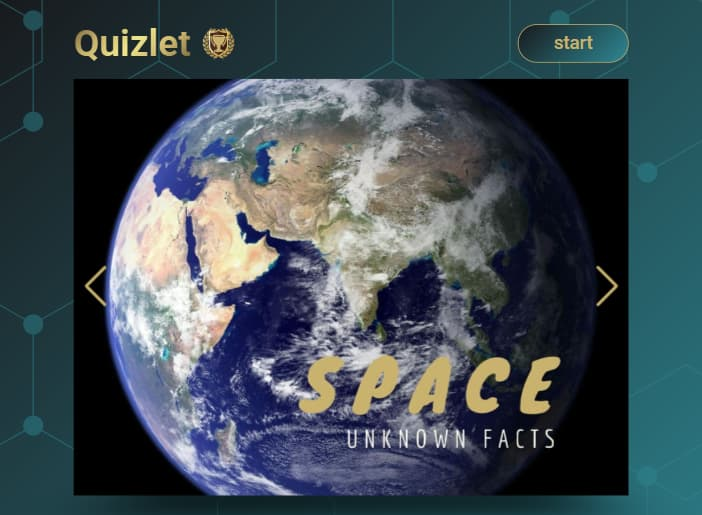
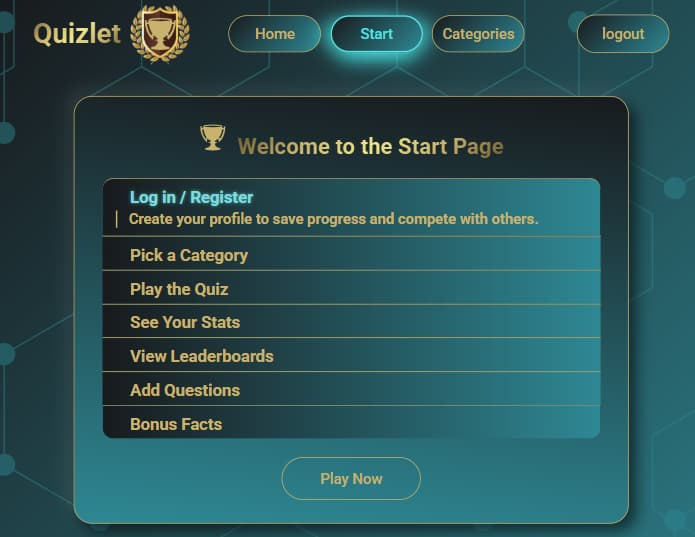
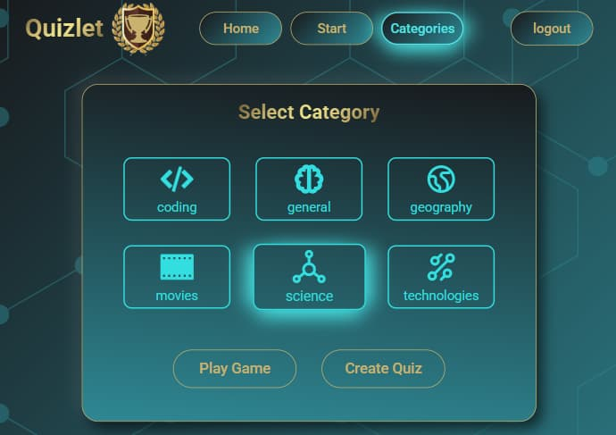
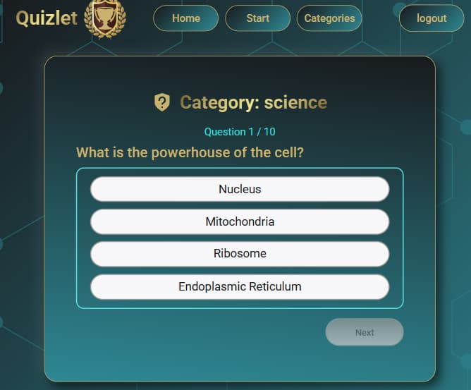
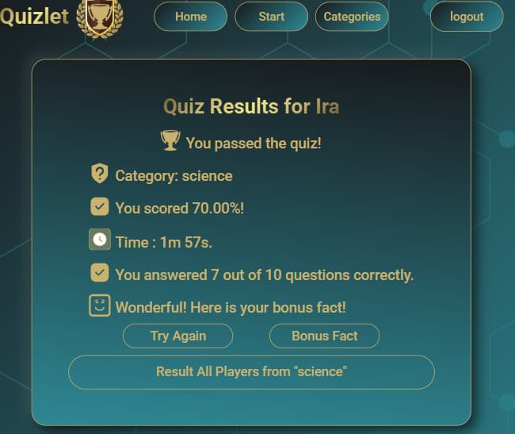
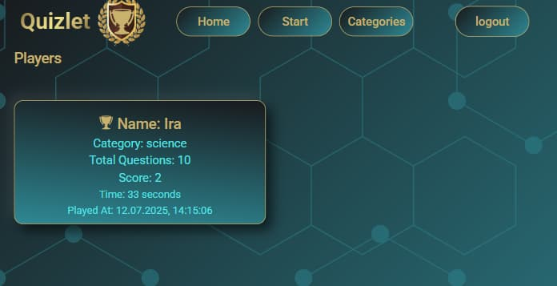
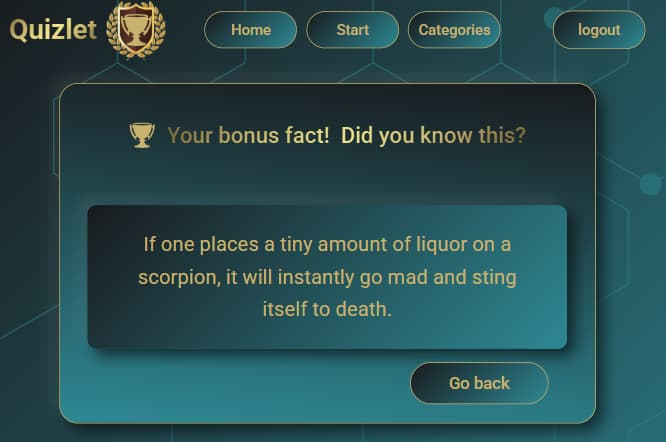

# React + Vite

# 🏆Quizlet

## 🚀 _Quizlet is an interactive and educational game!_

### _Here you can participate in quizzes and even create your own quiz questions for the game!_

### _Explore, learn, and share your knowledge in a fun and engaging way._

---

## 📷 Gallery

  
  
  
  
  
  
  
  

---

## Pages Overview

| 🧩 Main Pages   | 🎮 Game Flow  | 💡 User Pages |
| --------------- | ------------- | ------------- |
| Home            | Start         | Login         |
| Category        | Game          | Registration  |
| Result          | Bonus Fact    | Profile       |
| Create Question | Edit Question | View Players  |

---

## Core Features

- Create, edit, and delete your own quiz questions
- API integration for random bonus facts
- Category selection and result tracking
- Fully responsive design for mobile and desktop
- User authentication via Firebase
- State management with Redux

---

## 🛠️ Technologies & Libraries

- **React & React Router** – app structure and routing
- **Firebase** – user authentication and data base
- **Redux Toolkit** – app state management
- **Featch** – data fetching
- **Yup** – form validation
- **React Toastify** – notifications
- **Swiper** – swiper photo cube
- **Modern Normalize** – CSS normalization
- **Clsx** – dynamic styling

---

## Features

- **Technology Stack**: Built as a monorepo with React for the frontend and
  Firebase for the backend.
- **Routing**: Comprehensive routing for easy navigation through the
  application.
- **Authentication**: Includes forms for login and registration.
- **Question Creation**: Allows users to create their own quiz questions.
- **Pagination**: Navigate through different pages seamlessly.
- **Private Routes**: Includes a private section for view player rating, bonus
  page.

---
