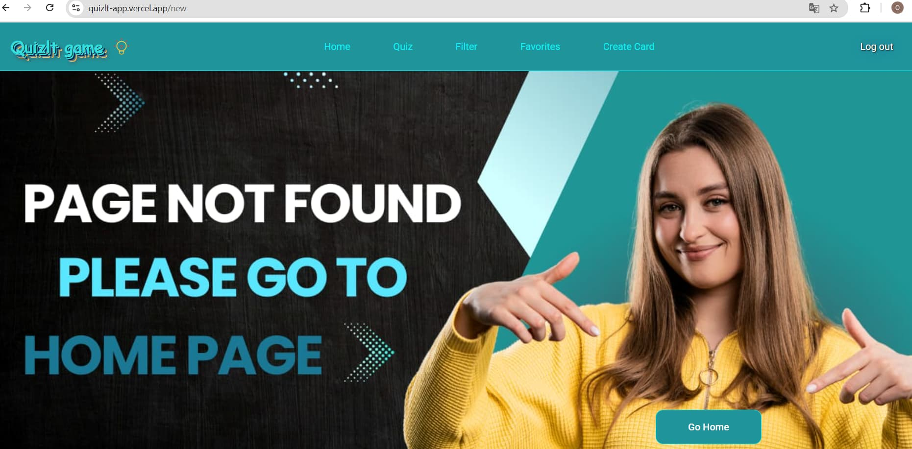
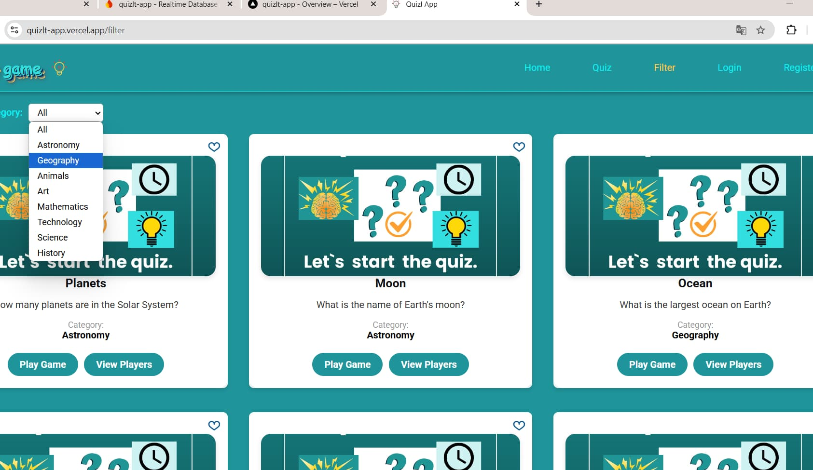
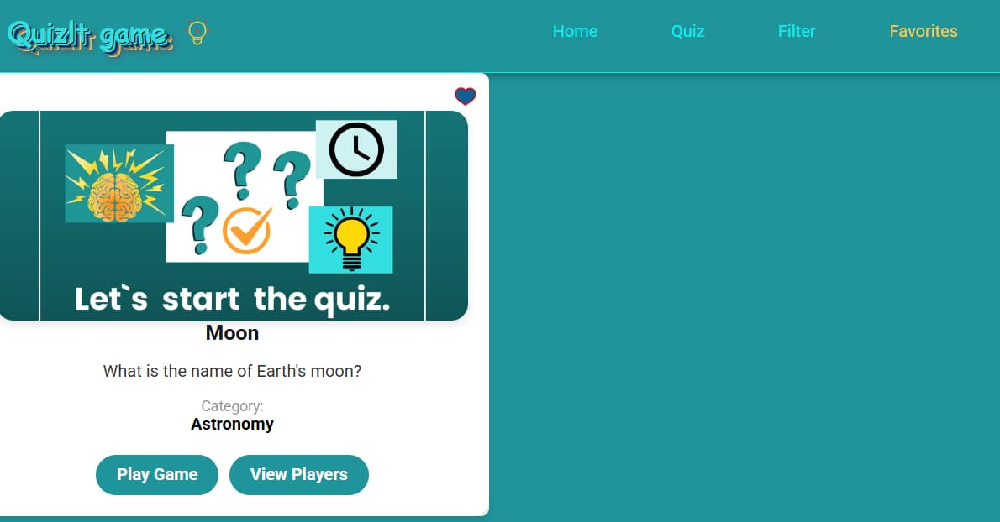
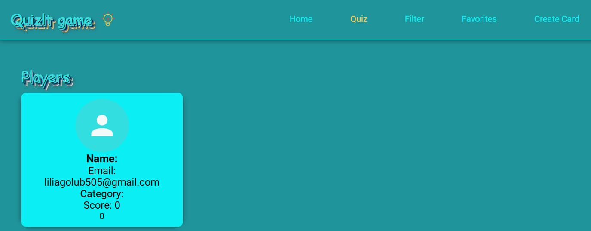
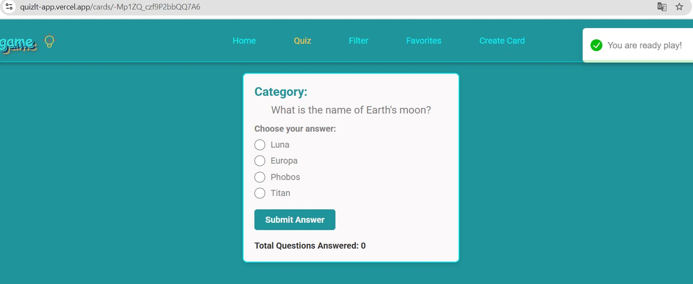
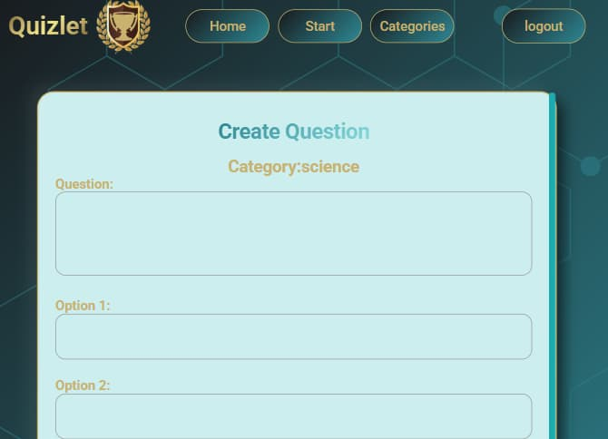

# React + Vite

# Quizlt

## Quizlt is an interactive and educational game where you can participate in quizzes and even create your own quiz cards! Explore, learn, and share your knowledge in a fun and engaging way.

## Screenshot live site

  
  
  
  
  
  
  

## Features

- **Technology Stack**: Built as a monorepo with React for the frontend and
  Firebase for the backend.
- **Routing**: Comprehensive routing for easy navigation through the
  application.
- **Authentication**: Includes forms for login and registration.
- **Card Creation**: Allows users to create their own quiz cards with questions
  for the game.
- **Pagination**: Navigate through different pages seamlessly.
- **Category Filtering**: Filter quiz cards by specific categories for a
  personalized experience.
- **Private Routes**: Includes a private section for your favorite cards, which
  can be added or removed as needed.

---

_Sorry, I couldn't fix created card the bugs due to limited time. Thank you for
this opportunity!_
